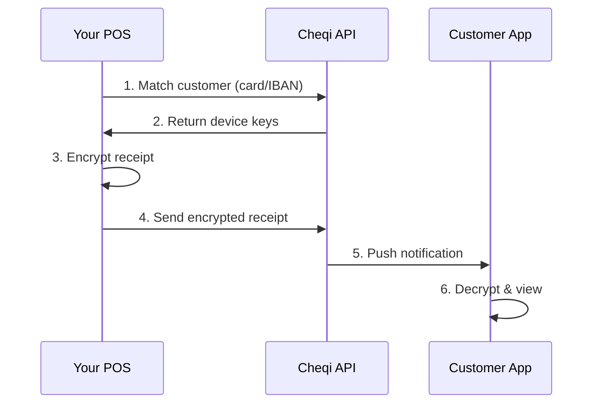

## What is Cheqi?

Cheqi is a **complete receipt delivery solution** that handles everything from customer matching to final delivery. Send us your receipt data, and we take care of the rest - whether that's encrypted delivery to the Cheqi app or professional PDF emails for non-users.

**We handle your entire receipt workflow:**
- 🔍 Customer identification and matching
- 🔐 End-to-end encryption for app users
- 📧 Automatic PDF generation and email delivery for non-users
- 📱 Multi-device sync
- ✅ Delivery confirmation

Built with privacy and security at its core, Cheqi ensures that only customers can read their receipt data.

<CardGroup cols={2}>
  <Card title="End-to-End Encryption" icon="lock">
    Receipts are encrypted with hybrid RSA+AES encryption. Only customer devices can decrypt.
  </Card>
  <Card title="Privacy First" icon="shield">
    Cheqi servers cannot read receipt content. Customer data stays private.
  </Card>
  <Card title="Multi-Device Support" icon="mobile">
    Receipts sync across all customer devices automatically.
  </Card>
  <Card title="UBL Standard" icon="file-invoice">
    Industry-standard receipt format for compatibility and compliance.
  </Card>
</CardGroup>

## How It Works



## Choose Your Integration Path

Cheqi provides SDKs for multiple languages and two authentication methods:

### Available SDKs

<CardGroup cols={2}>
  <Card title="Java SDK" icon="java" href="/sdk/java">
    Production-ready for Java 11+
  </Card>
  <Card title=".NET SDK" icon="microsoft" href="/sdk/dotnet">
    Coming soon - C# and .NET 6+
  </Card>
  <Card title="Node.js SDK" icon="node-js" href="/sdk/nodejs">
    Coming soon - JavaScript/TypeScript
  </Card>
  <Card title="Python SDK" icon="python" href="/sdk/python">
    Coming soon - Python 3.8+
  </Card>
</CardGroup>

### Authentication Methods

Choose the authentication method that fits your use case:

<CardGroup cols={2}>
  <Card title="API Keys" icon="key" href="/authentication/api-keys">
    **For Merchants**
    
    Direct integration for your own POS system. Simple setup, full company access.
  </Card>
  <Card title="OAuth 2.0" icon="shield-halved" href="/authentication/oauth">
    **For Third Parties**
    
    Build integrations for multiple merchants with granular permissions.
  </Card>
</CardGroup>

## Quick Start

Get started in minutes with our Java SDK:

```java
// 1. Initialize SDK
CheqiSDK sdk = CheqiSDK.builder()
    .apiEndpoint(Environment.PRODUCTION)
    .apiKey(System.getenv("CHEQI_API_KEY"))
    .build();

// 2. Send receipt
ReceiptResult result = sdk.getReceiptService()
    .processCompleteReceipt(customer, receipt);

if (result.isSuccess()) {
    System.out.println("✅ Receipt delivered!");
}
```

<Card title="View Full Quickstart" icon="rocket" href="/quickstart">
  Complete integration guide with examples
</Card>

## Key Features

### For Merchants

- 🎯 **Complete Solution** - We handle your entire receipt delivery process
- 🔐 **Secure Delivery** - End-to-end encrypted receipts for app users
- 📧 **Automatic PDF Emails** - Professional receipts for non-users (we generate and send)
- 📱 **Multi-Device Sync** - Receipts sync across all customer devices
- 🎨 **No Design Work** - We format and style all receipts professionally
- 📊 **Analytics** - Track receipt delivery and engagement

### For Developers

- 🚀 **Simple SDK** - One method to send receipts
- 🔑 **Flexible Auth** - API keys or OAuth 2.0
- 🌐 **Multi-Environment** - Sandbox, Test, Production
- 📖 **OpenAPI Spec** - Auto-generated API documentation
- 🛠️ **Type Safety** - Full Java SDK with builders

## Use Cases

<AccordionGroup>
  <Accordion title="Retail & E-commerce">
    Send digital receipts for in-store and online purchases. Reduce paper waste and improve customer experience.
  </Accordion>
  
  <Accordion title="Restaurants & Hospitality">
    Deliver receipts instantly after payment. Enable easy expense tracking for business customers.
  </Accordion>
  
  <Accordion title="Service Providers">
    Send invoices and receipts for services rendered. Support subscription billing with time-based products.
  </Accordion>
  
  <Accordion title="Marketplaces">
    Enable sellers to send receipts to buyers. Centralized receipt management for all transactions.
  </Accordion>
</AccordionGroup>

## Next Steps

<CardGroup cols={3}>
  <Card title="Quickstart" icon="rocket" href="/quickstart">
    Send your first receipt in 5 minutes
  </Card>
  <Card title="Authentication" icon="key" href="/authentication/overview">
    Choose your authentication method
  </Card>
  <Card title="API Reference" icon="code" href="/api-reference">
    Explore the complete API
  </Card>
</CardGroup>
