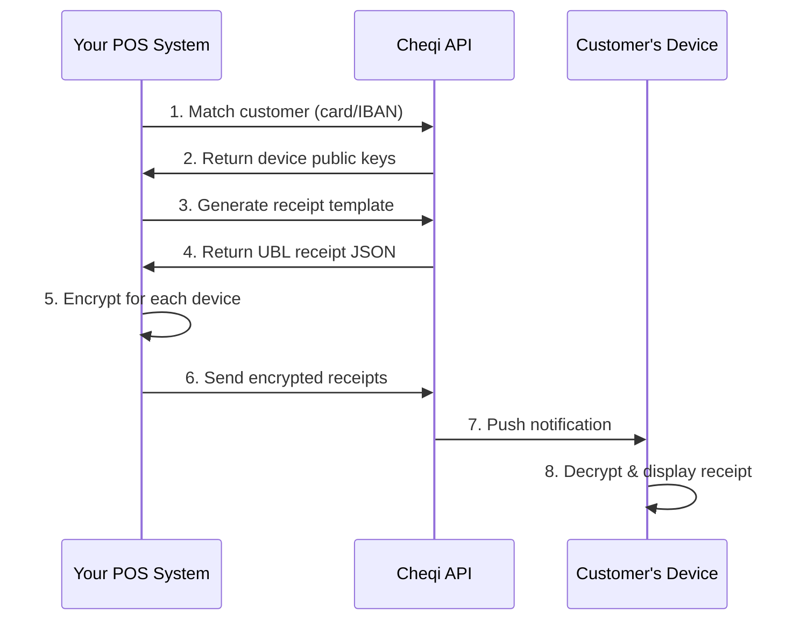

## How It Works

Cheqi handles your **entire receipt delivery process** - from customer matching to final delivery. You send us the receipt data, and we take care of everything else:

- 🔐 **End-to-end encrypted delivery** to customer devices
- 📧 **Automatic PDF email fallback** for non-users
- 📱 **Multi-device sync** across all customer devices
- 🎨 **Professional formatting** - no design work needed
- ✅ **Delivery confirmation** - know when receipts are delivered
- 🌍 **Country compliance** - receipts automatically comply with local regulations based on where they're issued

**You focus on your business, we handle the receipts.**



## The Complete Flow

### 1. Customer Identification

When a customer makes a payment, identify them using payment details:

<Tabs>
  <Tab title="Card Payment">
    ```java
    IdentificationDetails customer = IdentificationDetails.builder()
        .paymentType(PaymentType.CARD_PAYMENT)
        .cardDetails(CardDetails.builder()
            .paymentAccountReference("PAR123456789")  // From payment terminal
            .cardProvider(CardProvider.VISA)
            .build())
        .build();
    ```
  </Tab>
  
  <Tab title="IBAN Payment">
    ```java
    IdentificationDetails customer = IdentificationDetails.builder()
        .paymentType(PaymentType.IBAN_PAYMENT)
        .iban("NL91ABNA0417164300")
        .build();
    ```
  </Tab>
  
  <Tab title="Email Fallback">
    ```java
    IdentificationDetails customer = IdentificationDetails.builder()
        .paymentType(PaymentType.CARD_PAYMENT)
        .cardDetails(CardDetails.builder()
            .paymentAccountReference("PAR123456789")
            .cardProvider(CardProvider.VISA)
            .build())
        .customerEmail("customer@example.com")  // Fallback if not found
        .build();
    ```
  </Tab>
</Tabs>

<Info>
  **Payment Account Reference (PAR)** is a unique, tokenized identifier provided by payment terminals. It's more privacy-friendly than card numbers.
</Info>

### 2. Receipt Template Generation

Create a UBL-compliant receipt template from your transaction data:

```java
ReceiptTemplateRequest receipt = ReceiptTemplateRequest.builder()
    .documentNumber("INV-2024-001")
    .issueDate(Instant.now())
    .currency("EUR")
    .totalAmount(new BigDecimal("121.00"))
    .totalTaxAmount(new BigDecimal("21.00"))
    
    // Add products
    .addProduct(Product.builder()
        .name("Coffee")
        .quantity(2.0)
        .unitCode(UnitCode.ONE)
        .unitPrice("5.00")
        .subtotal("10.00")
        .total("12.10")
        .addTax(21.0, "VAT", "2.10")
        .build())
    
    // Add tax breakdown
    .addTax(Tax.builder()
        .rate(21.0)
        .type("VAT")
        .taxableAmount("10.00")
        .amount("2.10")
        .label("VAT 21%")
        .build())
    
    .build();
```

### 3. Hybrid Encryption

Cheqi uses **hybrid encryption** for maximum security and performance:

<Steps>
  <Step title="Generate AES Key">
    A unique **AES-256** key is generated for each receipt
  </Step>
  
  <Step title="Encrypt Receipt Data">
    The receipt JSON is encrypted with **AES-256-GCM** (authenticated encryption)
  </Step>
  
  <Step title="Encrypt AES Key">
    The AES key is encrypted with each device's **RSA-2048 public key**
  </Step>
  
  <Step title="Send to Backend">
    Encrypted receipt + encrypted keys are sent to Cheqi
  </Step>
</Steps>

**Why Hybrid Encryption?**

- 🔐 **End-to-End Security** - Only customer devices can decrypt
- ⚡ **Performance** - AES is fast for large data
- 🔑 **Forward Secrecy** - Unique keys per receipt
- 📱 **Multi-Device** - Encrypt once, deliver to all devices

### 4. Delivery & Decryption

Once encrypted receipts reach Cheqi:

1. **Push Notification** sent to customer's devices
2. **Device Downloads** encrypted receipt
3. **RSA Decryption** of AES key using device's private key
4. **AES Decryption** of receipt data
5. **Display** in Cheqi app

<Note>
  Cheqi servers **cannot decrypt** receipts. Only the customer's devices with the private keys can read the receipt content.
</Note>

## One-Method Integration

The SDK provides a single method that handles the entire flow:

```java
import com.cheqi.sdk.CheqiSDK;
import com.cheqi.sdk.models.*;
import com.cheqi.sdk.receipt.ReceiptResult;

// Initialize SDK
CheqiSDK sdk = CheqiSDK.builder()
    .apiEndpoint(Environment.PRODUCTION)
    .apiKey(System.getenv("CHEQI_API_KEY"))
    .build();

// Process complete receipt (one call does everything)
ReceiptResult result = sdk.getReceiptService()
    .processCompleteReceipt(
        identificationDetails,  // Customer identification
        receiptRequest          // Receipt data
    );

// Check result
if (result.isSuccess()) {
    System.out.println("✅ Receipt delivered to " + result.getReceiptCount() + " devices");
} else if (result.isCustomerNotFound()) {
    System.out.println("⚠️ Customer not found - prompt for email");
} else {
    System.out.println("❌ Failed: " + result.getMessage());
}
```

**This single method:**
- ✅ Matches the customer
- ✅ Generates the receipt template
- ✅ Encrypts for all devices
- ✅ Sends to Cheqi backend
- ✅ Returns delivery status

## Email Fallback - We Handle Everything

When a customer isn't registered with Cheqi, **we automatically generate a professional PDF receipt and send it via email**. No additional work required from you:

✅ **Automatic PDF generation** - We format your receipt data into a beautiful PDF
✅ **Email delivery** - We handle the entire email sending process
✅ **Professional design** - Branded, clean, and professional-looking receipts
✅ **No extra code** - Just include the email address, we do the rest

**You don't need to:**
- ❌ Generate PDFs yourself
- ❌ Set up email servers
- ❌ Design email templates
- ❌ Handle delivery failures

```java
IdentificationDetails customer = IdentificationDetails.builder()
    .paymentType(PaymentType.CARD_PAYMENT)
    .cardDetails(CardDetails.builder()
        .paymentAccountReference("PAR123456789")
        .cardProvider(CardProvider.VISA)
        .build())
    .customerEmail("customer@example.com")  // Include email
    .build();

ReceiptResult result = sdk.getReceiptService()
    .processCompleteReceipt(customer, receiptRequest);

if (result.isDeliveredViaEmail()) {
    System.out.println("📧 Receipt sent to: " + result.getEmailAddress());
}
```

**Automatic Delivery Logic:**
- ✅ **Customer found** → Encrypted digital receipt to Cheqi app (email ignored)
- ✅ **Customer not found + email provided** → Professional PDF receipt via email (we handle everything)
- ❌ **Customer not found + no email** → `isCustomerNotFound() = true` (prompt customer for email)

<Info>
  **Complete solution:** Whether your customer uses Cheqi or not, we ensure they receive their receipt. You send us the data once, and we handle all delivery scenarios.
</Info>

## Receipt Data Model

Cheqi uses the **UBL (Universal Business Language)** standard for receipts:

### Required Fields

| Field | Type | Description |
|-------|------|-------------|
| `documentNumber` | String | Invoice/receipt number (e.g., "INV-001") |
| `issueDate` | Instant | When the receipt was issued |
| `currency` | String | ISO 4217 code (e.g., "EUR", "USD") |
| `totalAmount` | BigDecimal | Total including tax |
| `totalTaxAmount` | BigDecimal | Total tax amount |

### Products

Each product line item includes:

```java
Product.builder()
    .name("Product Name")           // Required
    .quantity(1.0)                  // Required
    .unitCode(UnitCode.ONE)         // Required (see unit codes)
    .unitPrice("10.00")             // Required
    .subtotal("10.00")              // Required (before tax)
    .total("12.10")                 // Required (after tax)
    .sku("SKU-123")                 // Optional
    .brand("Brand Name")            // Optional
    .addTax(21.0, "VAT", "2.10")   // Tax breakdown
    .build()
```

### Tax Breakdown

Receipt-level tax summary:

```java
Tax.builder()
    .rate(21.0)                     // Tax percentage
    .type("VAT")                    // Tax type
    .taxableAmount("10.00")         // Amount before tax
    .amount("2.10")                 // Tax amount
    .label("VAT 21%")               // Display label
    .build()
```

## Unit Codes

Use standardized unit codes for products:

| Category | Examples |
|----------|----------|
| **Count** | `ONE`, `EACH`, `PAIR`, `DOZEN` |
| **Weight** | `KILOGRAM`, `GRAM`, `POUND` |
| **Volume** | `LITER`, `MILLILITER`, `GALLON_US` |
| **Length** | `METER`, `CENTIMETER`, `FOOT` |
| **Time** | `HOUR`, `DAY`, `WEEK`, `MONTH` |
| **Packaging** | `BOX`, `BOTTLE`, `CAN`, `BAG` |

See the [full unit code reference](/receipts/unit-codes) for all 70+ codes.

## Receipt States

Track receipt delivery status:

| State | Description |
|-------|-------------|
| `SUCCESS` | Delivered to customer's app |
| `EMAIL_SENT` | Sent via email (customer not found) |
| `CUSTOMER_NOT_FOUND` | No match found, no email provided |
| `FAILED` | Processing error occurred |

## Best Practices

<AccordionGroup>
  <Accordion title="Always Include Email When Available">
    Provide email as fallback to ensure receipt delivery:
    
    ```java
    // ✅ GOOD - Email fallback
    IdentificationDetails.builder()
        .paymentType(PaymentType.CARD_PAYMENT)
        .cardDetails(...)
        .customerEmail("customer@example.com")
        .build();
    ```
  </Accordion>

  <Accordion title="Use Payment Account Reference (PAR)">
    PAR is more privacy-friendly than card numbers:
    
    ```java
    // ✅ GOOD - Use PAR from terminal
    .paymentAccountReference("PAR123456789")
    
    // ❌ AVOID - Don't use card numbers
    .cardNumber("4111111111111111")  // Not supported
    ```
  </Accordion>

  <Accordion title="Validate Amounts Before Sending">
    Ensure totals match:
    
    ```java
    BigDecimal subtotal = products.stream()
        .map(Product::getSubtotal)
        .reduce(BigDecimal.ZERO, BigDecimal::add);
    
    BigDecimal taxTotal = products.stream()
        .map(Product::getTaxAmount)
        .reduce(BigDecimal.ZERO, BigDecimal::add);
    
    BigDecimal total = subtotal.add(taxTotal);
    
    assert total.equals(receiptRequest.getTotalAmount());
    ```
  </Accordion>

  <Accordion title="Handle Errors Gracefully">
    Implement retry logic for transient failures:
    
    ```java
    int maxRetries = 3;
    for (int i = 0; i < maxRetries; i++) {
        try {
            ReceiptResult result = sdk.getReceiptService()
                .processCompleteReceipt(customer, receipt);
            
            if (result.isSuccess()) {
                break;
            }
        } catch (CheqiSDKException e) {
            if (i == maxRetries - 1) {
                // Log error and notify support
                logger.error("Failed to send receipt after {} retries", maxRetries, e);
            }
            Thread.sleep(1000 * (i + 1)); // Exponential backoff
        }
    }
    ```
  </Accordion>
</AccordionGroup>

## Next Steps

<CardGroup cols={2}>
  <Card title="SDK Integration" icon="code" href="/sdk/java">
    Integrate the Java SDK into your application
  </Card>
  <Card title="Product Examples" icon="shopping-cart" href="/receipts/products">
    Learn how to structure different product types
  </Card>
  <Card title="Testing" icon="flask" href="/receipts/testing">
    Test your integration in sandbox
  </Card>
  <Card title="Error Handling" icon="triangle-exclamation" href="/receipts/errors">
    Handle errors and edge cases
  </Card>
</CardGroup>
